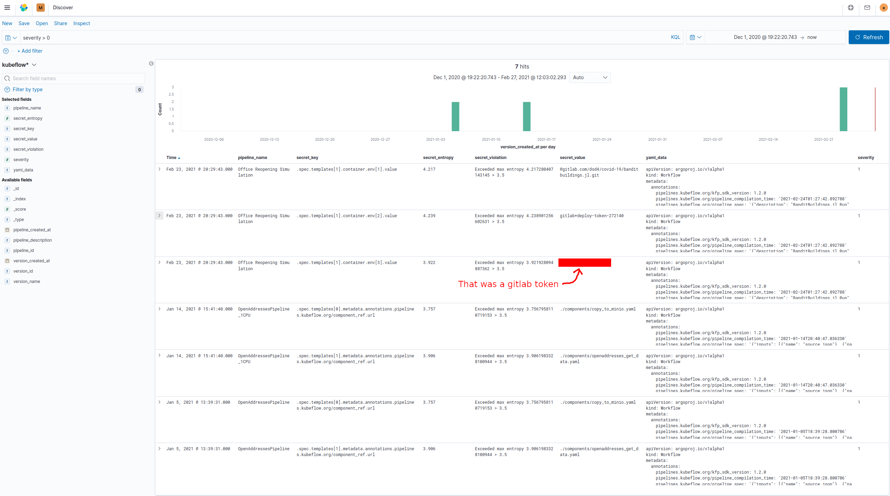
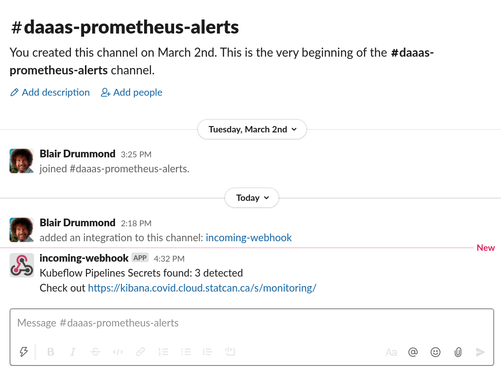

# kfp-secret-scanner

Scan for Kubeflow pipelines secrets. 

## How to use it

1. Push the `app` to `$REGISTRY/kfp-secret-scanner:$VERSION`
2. Configure the `chart/values.yaml` file accordingly
3. Create the `elastic-creds` secret using `create-elk-secret.sh` (it will prompt you)
4. Deploy the helm chart as you please, adding the `imagePullSecret` and namespace, probably.
5. If you want, trigger a manual run with `./manual-run.sh -n $NAMESPACE`

Then voila! Check kibana.

# Attribution

The secret scanner borrows from [Trufflehog](https://github.com/dxa4481/truffleHog), and 
the code and inspiration for scraping the kubeflow pipelines API came from [@wg102's repo](https://github.com/wg102/kubeflow_pipeline_detection).
